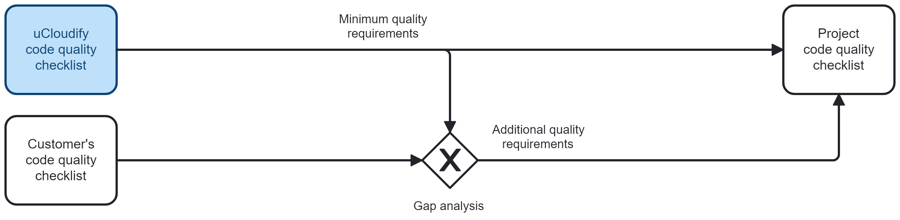
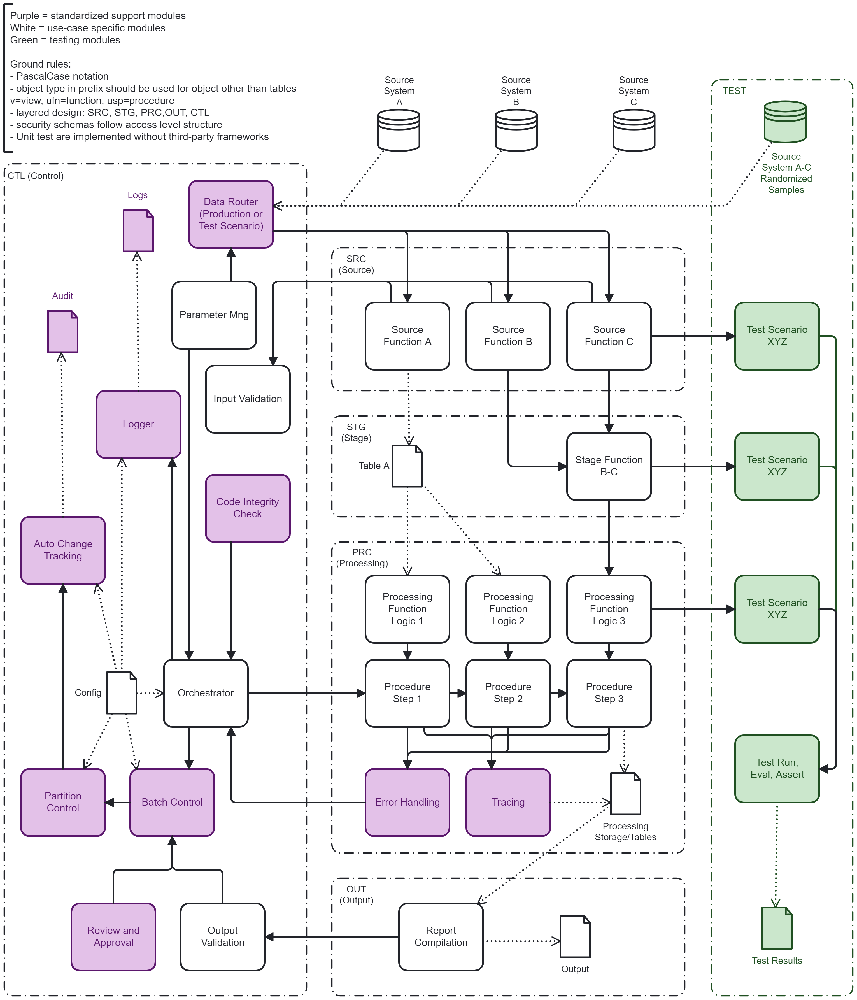

# Quality Check - Data Warehouse MSSQL

For every project we consider customized quality requirements:

 

This repository: 
- outlines our internal quality requirements
- is for evaluation purposes only
- does not disclose specific security design
- does not contain any customer-related information

## App Design

 

## Checklist MSSQL

- **README file** must be included in the git repository. It must provide information regarding (a) documentation, (b) license, (c) support, (d) maintenance, (e) dependencies, (f) life cycle management (g) security, and (h) the publisher.

- **Requirements** must be documented in the "docs"-folder of the git repository, this includes system context, features and use cases. 

- **Code design** must be described in the "docs"-folder of the git repository. This includes programming pattern and future maintenance. The correct future adjustments should be enforced by using suitable interfaces. The design must be based on the of the widely recognized programming approaches such as modular programming combined with DTO-approach. Decoupling and single purpose principle must be ensured by design. The solution must be testable, maintainable, and replaceable without disturbing the function of other components or solutions.

- **Coding guidelines** used must correspond to the customer's policies. By defaults: (a) PascalCase should be used for all modules and variables, regardless of their scope or function, (b) the modules are organized in the sections source, stage, work, output, and control, (c) each process has a central orchestrator and parameter manager, (d), readability must be ensured by abstraction and understandable naming. Nested procedures and functions must have maximum of four levels.

- **Secure data consumption** must implemented by default. Data consumed from other sources should be fetch using objects unable to alter or delete data in the source system, such as views or user defined functions.

- **Input validation** must be implemented. In the case of invalid inputs, error handling and logging must be triggered.

- **Tracing** of the data origin and each work step within the application should be traceable. The tracer should provide technical insights into each data row and each step. The tracer is meant for deep data analysis and troubleshooting by data analysts. It should be optional and turned off in production for improved performance. 

- **Batch control** must track each produced data set including current processing status, validation status and approval status. Each batch must be attributable to a specific execution with auditable records of parameters applied, source data, user, execution time and any other relevant information.

- **Testable logic** must be ensured by design. The application logic must be broken down to small sections of testable code, such as user defined functions.

- **Behaviour-driven development (BDD)** should be applied in case of multiple execution scenarios. Every scenario should be implemented in testable way. 

- **Output validation** must be implemented. In the case of invalid outputs, error handling and logging must be triggered.

- **Development environment** must be completely separate from production and must contain only test data. The development environment must provide full data protection and be accessible only by authenticated users. The development environment must provide the same level of security as applied in the production. The development environment must be auditable. The development environment should have three distinguishable parts: (a) dev assets that are meant for deployment in the final stage, (b) the test assets that consist of programmable test assets and (c) test data assets that may contain only anonymized and pseudonymized  data (data from production is not allowed in any of these three parts).

- **Test data** must be sufficiently randomized, anonymised and pseudonymised, so that it does not contain any information protected by the GDRP, financial law or other regulation.

- **Secrets management** must take place outside the application, the SQL scripts may never contain any credentials, login information or any other secrets. 

- **Code review** must take place before every merge into the release branch. This is ensured by role division between developers and technical lead in every project. Developers can never merge into release branch directly.

- **Security review** must be carried out as part of code review. Potential code-based vulnerabilities, such as SQL injection, arise from faulty implementation or any other discovered code-based security issues must be fixed immediately, regardless of the next release schedule. 

- **Execution profiles** must be separate for (a) production and (b) development and testing. Each execution profile has to be configured separately.

- **Error handling** must be implement for all potential misbehaviours of the application. All errors must notify the user about the failed execution via process status.

- **Logging** must be implemented for all errors. It should also provide information in regard to the use of the application, such as frequency of use, number of users and execution time. Log must not contain any personal, financial or other sensitive data.

- **Unit testing** must provide 100% coverage for any components deemed critical. This includes (a) any commands addressed to shared resource, such as a server, (b) actions that overwrite data outside the app's db objects, such as tables on linked servers (c) any actions that may cause overload of infrastructure (d) any actions that may cause data loss. The unit tests have to be structured in three sections: (1) arrange, (2) act, and (3) assert. The implementation of the unit tests must not utilite any open-source or third-party frameworks unless approved by the customer.

- **Compatibility** across different versions of the MS SQL Server must be ensured. 

- **System testing** must be done in a test environment separate from the production. This test environment must match the production environment in terms of the tech stack.

- **Dependencies** have to be limited to the libraries which are already part of the official MS SQL Server product. No open-source or third-party frameworks can be used. All dependencies must be documented in the README-file.

- **Integration testing** with other components such backend services or frontend applications must be carried out in a test environment. This test environment must match the target infrastructure and setup. 

- **Deployment assets** must be cleaned up, especially in regard to unnecessary comments, unresolved issues, and temporary test assets.

- **Parameters** must be managed by a dedicated module. Each data production has to be logged including the parameters used.

- **Configuration** must be separate from the application logic. Configuration must be defined for each execution profile and execution environment separately. The configuration files included in the repository may never contain any secrets or credentials. Configuration changes must be auditable. This means each change must be tracked by automatically triggered entries in the persistent storage. 

- **Threat modelling** of the customer's systems must be considered. The modular SQL application must function within the restrictions and security measures implemented in the target system.    

- **Vulnerability management** must be implemented for any components that are not an official part of the MS SQL Server product. Such components may not be used, unless exception is requested by the customer.

- **Code scans** must be executed on any component that is not an official part of the MS SQL Server product. Such components may however not be used, unless exception is requested by the customer.

- **Manifest** must be included in the programmable objects. Its purpose is to validate the current version of the modular T-SQL application. If the app is outdated, all functions must be disabled. The user must be notified that this version is no longer valid by an error entry. 

- **Software recall** must be possible. This means that every application or script must validate its own source code against a central registry before execution.

- **Code integrity** must be ensured by an irreversible cryptographic method.

- **Version control** must be implemented with git. On-premise legacy projects must be tracked using only reverse sync.

- **LICENSE file** must be included in the git repository.
 
